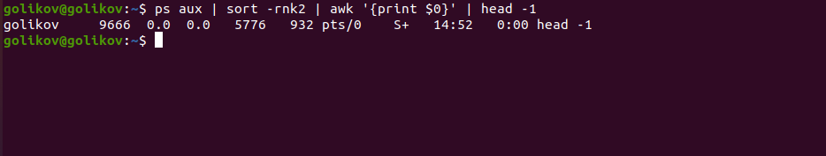

# Домашнее задание к занятию "5.3 Regexp и их использование для синтаксического анализа. Полезные утилиты."

------

### Задание 1.

Напишите регулярное выражение для проверки является ли строка `IPv4` адресом.

Для тестов можно использовать файл с содержимым:
```
192.168.0.1
127.0.0.1
84.345.23.11
88.3A.56.76
224.12.76
```

*Пришлите получившееся выражение в качестве ответа.*
```
(25[0-5]|2[0-4][0-9]|[01]?[0-9][0-9]?)\.(25[0-5]|2[0-4][0-9]|[01]?[0-9][0-9]?)\.(25[0-5]|2[0-4][0-9]|[01]?[0-9][0-9]?)\.(25[0-5]|2[0-4][0-9]|[01]?[0-9][0-9]?)
```

---

### Задание 2.

В Вашей конфигурации Nginx скопилось много неиспользуемых сегментов и становится сложно его читать.

Используя `sed` удалите все пустые строки и комментарии в конфигурации Nginx: 

Попробуйте сделать это одним запуском.

```
#user  nobody;
worker_processes  1;

#error_log  logs/error.log;
#error_log  logs/error.log  notice;
#error_log  logs/error.log  info;

#pid        logs/nginx.pid;


events {
    worker_connections  1024;
}


http {
    include       mime.types;
    default_type  application/octet-stream;

    #log_format  main  '$remote_addr - $remote_user [$time_local] "$request" '
    #                  '$status $body_bytes_sent "$http_referer" '
    #                  '"$http_user_agent" "$http_x_forwarded_for"';

    #access_log  logs/access.log  main;

    sendfile        on;
    #tcp_nopush     on;

    #keepalive_timeout  0;
    keepalive_timeout  65;

    #gzip  on;

    server {
        listen       80;
        server_name  localhost;

        #charset koi8-r;

        #access_log  logs/host.access.log  main;

        location / {
            root   html;
            index  index.html index.htm;
        }

        #error_page  404              /404.html;

        # redirect server error pages to the static page /50x.html
        #
        error_page   500 502 503 504  /50x.html;
        location = /50x.html {
            root   html;
        }

        # proxy the PHP scripts to Apache listening on 127.0.0.1:80
        #
        #location ~ \.php$ {
        #    proxy_pass   http://127.0.0.1;
        #}

        # pass the PHP scripts to FastCGI server listening on 127.0.0.1:9000
        #
        #location ~ \.php$ {
        #    root           html;
        #    fastcgi_pass   127.0.0.1:9000;
        #    fastcgi_index  index.php;
        #    fastcgi_param  SCRIPT_FILENAME  /scripts$fastcgi_script_name;
        #    include        fastcgi_params;
        #}

        # deny access to .htaccess files, if Apache's document root
        # concurs with nginx's one
        #
        #location ~ /\.ht {
        #    deny  all;
        #}
    }


    # another virtual host using mix of IP-, name-, and port-based configuration
    #
    #server {
    #    listen       8000;
    #    listen       somename:8080;
    #    server_name  somename  alias  another.alias;

    #    location / {
    #        root   html;
    #        index  index.html index.htm;
    #    }
    #}


    # HTTPS server
    #
    #server {
    #    listen       443 ssl;
    #    server_name  localhost;

    #    ssl_certificate      cert.pem;
    #    ssl_certificate_key  cert.key;

    #    ssl_session_cache    shared:SSL:1m;
    #    ssl_session_timeout  5m;

    #    ssl_ciphers  HIGH:!aNULL:!MD5;
    #    ssl_prefer_server_ciphers  on;

    #    location / {
    #        root   html;
    #        index  index.html index.htm;
    #    }
    #}

}
```


*Пришлите получившуюся команду в качестве ответа*

```
sed -E ‘/^\s*#/d;/^$/d’
```
------

### Задание 3.

Используя `awk` и `ps aux` соберите информацию о:
 - количестве процессов для каждого пользователя;
 - процессе с самым большим PID;
 - суммарном использовании памяти различными пользователями.

*Пришлите скриншоты со скриптами и демонстрацией их работы*

 - количестве процессов для каждого пользователя; ```ps aux | awk 'NR>1{total[$1]++;} END{for(id in total)print id,total[id])'``` 
 - процессе с самым большим PID; ```ps aux | sort -rnk2 | awk '{print $0}' | head -1``` 
 - суммарном использовании памяти различными пользователями. ```ps aux | awk '{s += $4} END "print %MEM:" s}'``` 

---
